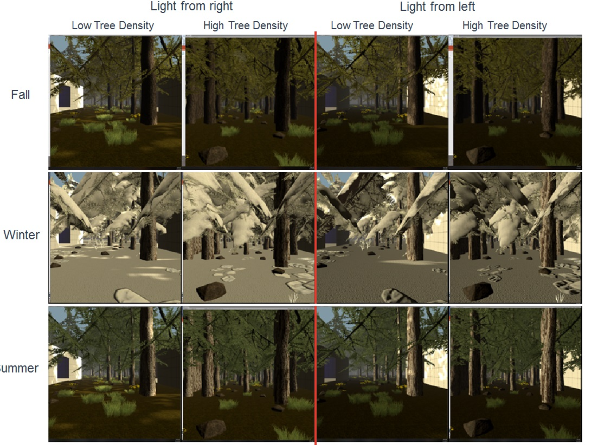

# Lifelong Learning Explorer (L2Explorer)


## Table of Contents

- [Setting up l2explorer_env](#introduction)
- [Trying out l2explorer_env](#metrics)
- [Testing Curricula for Continual Reinforcement Learning](#evaluation)
- [Benchmarking](#getting-started)
- [Procedurally generated worlds](#procedurally-generated-worlds)
- [Observation space](#observation-space)
- [Action Space](#action-space)
- [Observation Space](#observation-space)
- [Reward](#reward)
- [Episode Termination](#episode-termination)
- [Random Seed](#random-seed)
- [Changelog](#changelog)
- [License](#license)
- [Acknowledgements](#acknowledgements)

v1.0 Documentation


## Setting up 'l2explorer_env'

Lifelong Learning Explorer (L2Explorer) is a 3D Unity environment that provides first-person-view observations and challenges for a lifelong learning agent, particularly tailored to test continual reinforcement learning. For more details (including how to download and install the Unity environment), see the [docs/Getting_Started_with_L2Explorer.md](docs/Getting_Started_with_L2Explorer.md) file. 

This repository (`l2explorer_env`) is a Python interface that provides a OpenAI Gym-like environment to L2Explorer. It is built on top of the Unity ML-Agents framework (https://unity.com/products/machine-learning-agents).

## Trying out `l2explorer_env`

To test out the `l2explorer_env` environment, run the `examples/random_agent.py` script. Two example jsons are provided to get started quickly.  Note that you will need to be in the `l2explorer_env/examples/` folder to run the following command or you may alternatively specificy the full path name for the .py and .json scripts.

```bash
python random_agent.py -reps 1 -maxsteps 200 -jsonfile map0.json
```

## Testing Curricula for Continual Reinforcement Learning

The key contribution of L2Explorer is a set of testing curricula for testing lifelong learning agents and characterizing sensitivities to different changes.

These curricula test reinforcement learning agents against continual and discrete shifts in the reward, state, state transition, observation, and action spaces. 

## Benchmarking

Results are logged with l2logger, and metrics calculated with l2metrics.

## Procedurally generated worlds


L2Explorer enables a high degree of procedural generation of worlds for the agent, including:

- types and appearances of a variety of objects
- locations and probabilistic relationships between objects
- how agents may interact with objects (bump with positive or negative reward, pick them up, etc.)

For more information, see:

- [docs/Outline.md](docs/Outline.md) for details of the procedural specification format
- `examples/random_agent.py` for an example of how the procedural generation may be sent to the L2Explorer environment (it loads in the specification as a JSON file)
- `examples/linear_agent.py` and `examples/waypoint_agent.py` show additional examples of agents for controlling motion
- `examples/procedural_generation/` for how the JSON file might be generated
- `examples/spawning_agent.py` shows how the sidechannels can be used to dynamically spawn objects in the environment
- `examples/l2ex_guiagent.py` for a sample "GUI agent" that allows a human to interact with the L2Explorer world
- examples/logging provides examples for incorporating l2logger into the code

## Observation space

More details on the action observation space, and reward options cna be found in the docs folder. The options enabled with the default maps and tasks are listed below. An agent for these configurations can be found in `examples/random_agent.py`.

## Action Space

The default motion model is ByVelocity. Further models are planned but are still being tested
Action space is a [3,1] vector.

- Element 0 is the linear velocity command, specified between -max_linear_velocity and +max_linear_velocity parameter
- Element 1 is the angular velocity command, specified between -max_angular_velocity and +max_angular_velocity parameter
- Element 2 is the pickup action, which activates a pick-up action if the value is above 0.5. Below 0.5 is a no-op.

## Observation Space

The state, by default, returns a visual and vector observation

- visual_obs = state["visual"] # list of visual observation
- state_vector = state["state"] # length 4 array with x,y,theta,velocity of agent in world frame

The visual observation contains 3 observations in a list- the first is a depth image, the second is a RGB image, third is a semantic segmentation.
All are shape [84,84,3] by default. Currently, images need to be resized in python code, and high-resolution observation cannot be produced by Unity.

## Reward

The object reward is set in the json for the environment, specified by setting the agent interaction parameters as specified in docs/outline.md. Supported interactions include collision, interaction, and in_range. Objects can also be destroyed with the same conditions.

## Episode Termination

By default, the episode terminates when "max_steps" is reached.

## Random Seed

You can control the seed by calling L2ExplorerTask.seed with the desired value. Otherwise, the default environment seed is 1234.

## Changelog

See [CHANGELOG.md](./CHANGELOG.md) for a list of notable changes to the project.

## License

See [LICENSE.md](LICENSE.md) for license information.

## Acknowledgements

Primary development of Lifelong Learning Explorer (L2Explorer) was funded by the DARPA Lifelong Learning Machines (L2M) Program.

© 2022 The Johns Hopkins University Applied Physics Laboratory LLC

## Disclaimer 

The views, opinions, and/or findings expressed are those of the author(s) and should not be interpreted as representing the official views or policies of the Department of Defense or the U.S. Government.