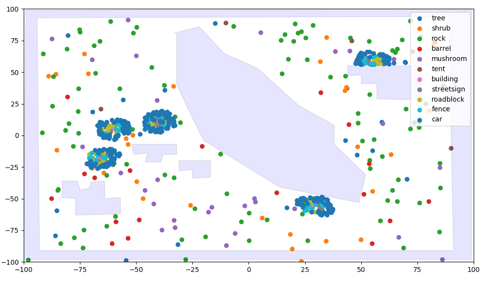

# Procedural Generation

v1.0.0 Documentation

The `.py` files in this directory are examples of procedural generation. This is a standalone capability and is not dependent on Learnkit or L2Explorer.
The outputs are written to JSON files (for `example1.py`, it is `resetparams1.json`; for `example2.py` it is `resetparams2.py`, etc.)

Run it as follows:

```bash
python example2.json
```


